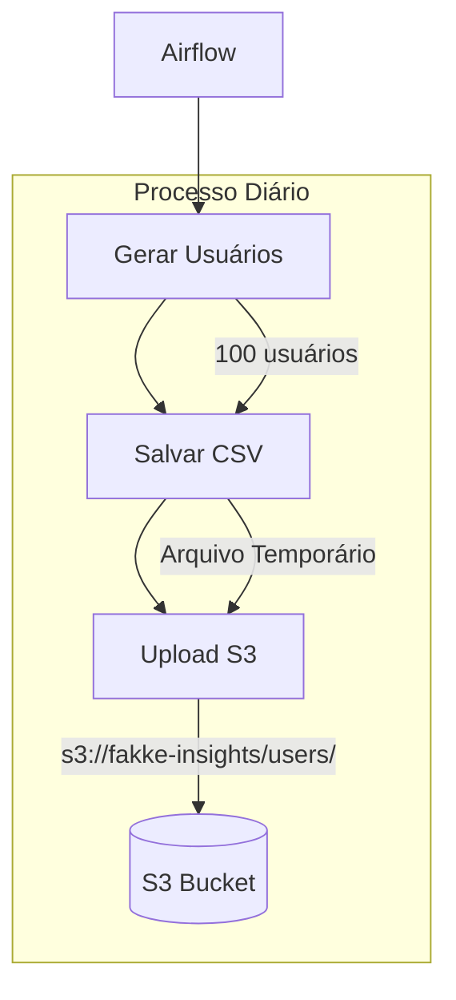

# Fakke Insights

Projeto de geração e análise de dados de usuários falsos usando Apache Airflow.

## Visão Geral

Este projeto utiliza Apache Airflow para gerar dados de usuários falsos e fazer upload para um bucket S3. O pipeline é executado diariamente e gera 100 usuários aleatórios com informações como nome, email, idade, gênero, localização e data de registro.

## Arquitetura



## Tecnologias

- Apache Airflow 2.6.3
- Python 3.10
- Boto3 (AWS SDK)
- Faker (geração de dados)
- Docker & Docker Compose

## Configuração

1. Clone o repositório:
```bash
git clone https://github.com/Pacodeoliv/fakke-insights.git
cd fakke-insights
```

2. Crie o arquivo `.env` com suas credenciais AWS:
```bash
AWS_ACCESS_KEY_ID=sua_access_key
AWS_SECRET_ACCESS_KEY=sua_secret_key
AWS_DEFAULT_REGION=sa-east-1
```

3. Inicie o Airflow:
```bash
docker-compose up -d
```

4. Acesse a interface do Airflow:
```
http://localhost:8080
```
- Usuário: admin
- Senha: admin

## Estrutura do Projeto

```
fakke-insights/
├── dags/                    # DAGs do Airflow
│   └── generate_upload_users.py
├── data/                    # Dados gerados
├── logs/                    # Logs do Airflow
├── plugins/                 # Plugins do Airflow
├── docker-compose.yml       # Configuração Docker
├── requirements.txt         # Dependências Python
└── README.md               # Documentação
```

## DAGs

### generate_upload_users

- **Descrição**: Gera 100 usuários falsos e faz upload para o S3
- **Frequência**: Diária
- **Tasks**:
  1. `upload_to_s3`: Gera dados e faz upload para o S3

## Contribuição

1. Faça um fork do projeto
2. Crie uma branch para sua feature (`git checkout -b feature/nova-feature`)
3. Commit suas mudanças (`git commit -m 'Adiciona nova feature'`)
4. Push para a branch (`git push origin feature/nova-feature`)
5. Abra um Pull Request

## Licença

Este projeto está sob a licença MIT. Veja o arquivo [LICENSE](LICENSE) para mais detalhes.
